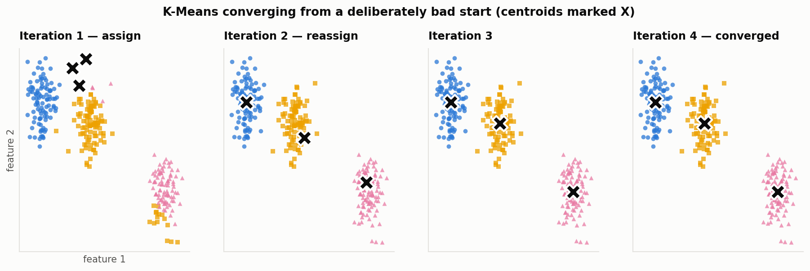
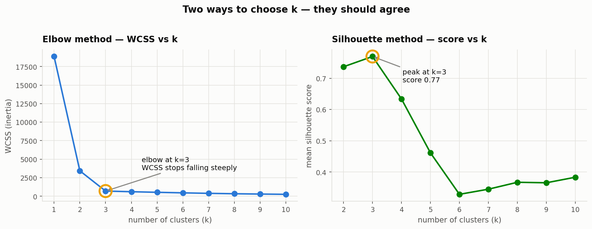
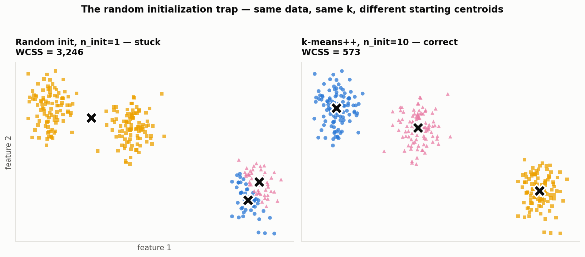

# K-Means Clustering

K-Means is the algorithm you reach for when you have data with **no labels** and
you suspect it contains natural groups. You tell it how many groups to look for,
and it finds them.

This README explains the handwritten deck
([Kmeans+clustering.pdf](<Kmeans+clustering.pdf>)) and the companion notebook
([K+Means+Clustering+Algorithms+implementation.ipynb](<K+Means+Clustering+Algorithms+implementation.ipynb>)),
and fills in the parts they leave implicit — the objective function, why the
elbow bends, when scaling matters, and where the algorithm quietly fails.

When you're ready to use it on real data, [project.md](<project.md>) works a mall
customer-segmentation problem end to end.

| Section | What it answers |
| ------- | --------------- |
| [1. The problem](#1-the-problem-grouping-without-labels) | Why cluster at all? |
| [2. The algorithm](#2-the-algorithm-three-steps-in-a-loop) | What does K-Means actually do? |
| [3. Worked by hand](#3-one-full-run-worked-by-hand) | Can I see the arithmetic? |
| [4. Distance](#4-distance-euclidean-vs-manhattan) | Euclidean or Manhattan? |
| [5. WCSS](#5-wcss--what-k-means-is-actually-minimizing) | What is it optimizing? |
| [6. Choosing k](#6-choosing-k) | How many clusters? |
| [7. The initialization trap](#7-the-random-initialization-trap-and-k-means) | Why `k-means++`? |
| [8. Scaling](#8-feature-scaling--when-it-matters-and-when-it-doesnt) | Do I need StandardScaler? |
| [9. Where it breaks](#9-where-k-means-breaks) | When should I not use this? |
| [10. The API](#10-the-scikit-learn-api) | What do the parameters mean? |

---

## 1. The problem: grouping without labels

In **supervised** learning your data comes with an answer column — age and
experience in, salary out. You can check your work: predict a salary, compare it
to the real one, measure the error.

In **unsupervised** learning there is no answer column. You have customers, and
nothing telling you which ones are similar. The job is to *invent* the labels:

```text
   Unlabeled data                    Labeled by the algorithm
   ─────────────                     ────────────────────────
   ×  ×   ×                              ●  ●   ●     ← cluster 0
     ×  ×        ──── K-Means ────►        ●  ●
        ×   ×                                 ▲   ▲   ← cluster 1
      ×    ×  ×                             ▲    ▲  ▲
```

A good clustering satisfies two properties, and they pull in opposite directions:

1. **Cohesion** — points inside a cluster should be similar to each other.
2. **Separation** — points in different clusters should be as different as possible.

> **Why this matters practically:** you cannot compute "accuracy" for a
> clustering, because there is no ground truth to compare against. Every quality
> measure in this document is really a measure of cohesion, separation, or the
> trade-off between them. Keep that distinction in mind — it is the single
> biggest conceptual difference from supervised learning.

---

## 2. The algorithm: three steps in a loop

The deck reduces K-Means to three steps. That is genuinely all there is:

```text
  ①  Initialize K centroids
         │
         ▼
  ②  ASSIGN — give every point to its nearest centroid
         │
         ▼
  ③  UPDATE — move each centroid to the average of its points
         │
         └──── repeat ② and ③ until nothing changes
```

Step ② and step ③ alternate. This pattern has a name — **Expectation
Maximization**:

- **Expectation (assign):** centroids are held fixed; work out which cluster each
  point belongs to.
- **Maximization (update):** assignments are held fixed; move each centroid to
  the best possible position for its members, which is their mean.

Here is that loop running on real data, starting from three centroids deliberately
placed in the wrong corner:



Notice that most of the work happens in the **first two iterations**. By panel
three the centroids are essentially in place; panel four just confirms nothing
moved. This is typical — K-Means usually converges in tens of iterations, not
thousands.

### When does it stop?

Three standard stopping criteria, any of which will do:

| Criterion | Meaning |
| --------- | ------- |
| Centroids stop moving | The update step produced no change (within `tol`) |
| Assignments stop changing | Every point stayed in the cluster it was already in |
| Max iterations reached | A safety valve — `max_iter`, default 300 in sklearn |

K-Means is **guaranteed to converge**: every one of the two steps can only
decrease WCSS (see [§5](#5-wcss--what-k-means-is-actually-minimizing)), and WCSS
is bounded below by zero, so it cannot decrease forever. What is *not* guaranteed
is that it converges to the **best** answer — see
[§7](#7-the-random-initialization-trap-and-k-means).

---

## 3. One full run, worked by hand

Seven points, `k = 2`. Centroids start at the first and fourth points.

```text
Points:  P1(1, 1)   P2(1.5, 2)   P3(3, 4)   P4(5, 7)
         P5(3.5, 5) P6(4.5, 5)   P7(3.5, 4.5)

Initial centroids:  C0 = (1, 1)      C1 = (5, 7)
```

**Iteration 1 — assign.** Euclidean distance from each point to each centroid:

| Point | → C0 (1, 1) | → C1 (5, 7) | Nearest |
| ----- | ----------: | ----------: | ------- |
| P1 (1, 1)     | 0.00 | 7.21 | **C0** |
| P2 (1.5, 2)   | 1.12 | 6.10 | **C0** |
| P3 (3, 4)     | 3.61 | 3.61 | **tie** → C0 |
| P4 (5, 7)     | 7.21 | 0.00 | **C1** |
| P5 (3.5, 5)   | 4.72 | 2.50 | **C1** |
| P6 (4.5, 5)   | 5.32 | 2.06 | **C1** |
| P7 (3.5, 4.5) | 4.30 | 2.92 | **C1** |

P3 is *exactly* equidistant — `sqrt(4 + 9)` from both. Ties are broken
arbitrarily (numpy's `argmin` takes the lower index), which is a small reminder
that cluster IDs carry no meaning of their own.

**Iteration 1 — update.** Each centroid moves to the mean of its members:

```text
C0 = mean of P1, P2, P3          = ((1 + 1.5 + 3)/3, (1 + 2 + 4)/3)     = (1.833, 2.333)
C1 = mean of P4, P5, P6, P7      = ((5 + 3.5 + 4.5 + 3.5)/4, ...)       = (4.125, 5.375)
```

**Iteration 2 — assign.** With the centroids moved, P3 now switches sides
(1.78 to C1 vs 2.03 to C0). Update again:

```text
C0 = mean of P1, P2                    = (1.25, 1.5)
C1 = mean of P3, P4, P5, P6, P7        = (3.9,  5.1)
```

**Iteration 3 — assign.** Every point stays where it is. The centroids recompute
to `(1.25, 1.5)` and `(3.9, 5.1)` — **identical to the last round**. Converged.

That is the entire algorithm. Everything else in this document is about choosing
`k`, choosing the starting centroids, and knowing when the result can be trusted.

---

## 4. Distance: Euclidean vs Manhattan

"Nearest centroid" needs a definition of *near*. Two are common.

```text
Euclidean distance  =  sqrt( (x2 − x1)² + (y2 − y1)² )      ← straight line
Manhattan distance  =  |x2 − x1| + |y2 − y1|                ← along the grid
```

```text
            (x2, y2)
               ●
             ╱ │
   Euclidean╱  │ B          Euclidean = the diagonal    = sqrt(A² + B²)
           ╱   │            Manhattan = A + B             (go across, then up)
          ●────┘
     (x1, y1)  A
```

The deck's two analogies are the clearest way to remember which is which:

- **Iron Man flying across the US** — he goes in a straight line over everything.
  That is **Euclidean**. Same for **air traffic**: planes fly the direct route.
- **A taxi in Manhattan** — it cannot fly. It drives along blocks, across and
  then up, because buildings are in the way. That is **Manhattan distance**
  (hence the name).

**Which should you use?** Euclidean is the default and is what makes the mean the
correct centroid update — so sklearn's `KMeans` supports Euclidean only. Manhattan
becomes preferable in **high dimensions**, where Euclidean distances between all
pairs of points converge toward each other and stop being informative (the "curse
of dimensionality"). If you want Manhattan, you want **K-Medoids** (`sklearn_extra`)
or `KMeans` on PCA-reduced data instead.

---

## 5. WCSS — what K-Means is actually minimizing

Everything above is a procedure. Here is the quantity it is driving down.

**WCSS** = **W**ithin **C**luster **S**um of **S**quares:

```text
           n
WCSS  =   ___    ( distance from point i to its nearest centroid )²
          ╲
          ╱
          ‾‾‾
          i=1
```

In words: for every point, measure how far it is from its own centroid, square
that, and add it all up. Low WCSS means tight clusters. In scikit-learn this is
the `.inertia_` attribute.

Now the two steps make sense as a minimization:

- **Assign** each point to its *nearest* centroid → cannot increase WCSS, because
  every point either keeps its distance or gets a shorter one.
- **Move** each centroid to its cluster's *mean* → cannot increase WCSS either.
  The mean is provably the point that minimizes summed squared distance to a set.

Both steps push WCSS down, WCSS can't go below zero, so the loop terminates. That
is the whole convergence proof.

### The one property that makes the elbow work

> **WCSS always decreases as `k` increases.** At `k = n` (one cluster per point)
> WCSS is exactly zero.

So you **cannot** pick `k` by minimizing WCSS — that always answers "use as many
clusters as you have points". This is why we need the elbow.

---

## 6. Choosing k

`k` is an input, not an output. Two methods, and you should run both.



### 6.1 The elbow method

Run K-Means for `k = 1, 2, 3, …, 10` (the deck says up to 20), record WCSS each
time, and plot it.

The curve always falls. What you are looking for is the **point where it stops
falling steeply** — the elbow. Before the elbow, each new cluster is splitting a
genuinely distinct group and buys a large WCSS reduction. After the elbow, each
new cluster is just slicing an already-coherent group in half, and buys very
little.

```python
from sklearn.cluster import KMeans

wcss = []
for k in range(1, 11):
    km = KMeans(n_clusters=k, init="k-means++", n_init=10, random_state=42)
    km.fit(X_scaled)
    wcss.append(km.inertia_)

plt.plot(range(1, 11), wcss, marker="o")
plt.xlabel("Number of clusters (k)")
plt.ylabel("WCSS")
```

**Reading the elbow numerically.** Rather than eyeballing it, look at the
percentage drop from each `k` to the next. The elbow is where the drop falls off
a cliff. On the mall dataset in [project.md](<project.md>):

| Step | WCSS drop |
| ---- | --------: |
| k=3 → 4 | 30.9% |
| k=4 → **5** | **39.8%** |
| k=5 → 6 | 16.0% ← collapses here |
| k=6 → 7 | 18.5% |

The last big drop is the one that buys you `k = 5`.

**Automating it — `KneeLocator`.** The notebook uses the `kneed` package, which
formalizes "elbow" as the point of maximum curvature:

```python
# pip install kneed
from kneed import KneeLocator

kl = KneeLocator(range(1, 11), wcss, curve="convex", direction="decreasing")
print(kl.elbow)   # -> 3 on the notebook's synthetic blobs
```

`curve="convex", direction="decreasing"` describes the shape of a WCSS curve:
falling, and bending upward. Those two arguments are always the same for an
elbow plot.

> If you don't want the extra dependency, the same idea in four lines: normalize
> both axes to 0–1, draw a straight chord from the first point to the last, and
> take the `k` whose point sits **furthest from that chord**. That is what
> "maximum curvature" means geometrically, and on the mall data it returns 5 —
> the same answer.

### 6.2 The silhouette score

The elbow is a judgement call — sometimes the curve is smooth and there is no
obvious corner. The **silhouette score** gives you an actual number to compare.

For a single point:

```text
a = mean distance to the other points in its OWN cluster      (cohesion)
b = mean distance to the points in the NEAREST OTHER cluster  (separation)

              b − a
silhouette = ─────────
             max(a, b)
```

| Value | Meaning |
| ----: | ------- |
| **+1** | `a` is tiny next to `b` — the point sits deep inside its cluster |
| **0** | `a ≈ b` — the point is on the border between two clusters |
| **−1** | `a > b` — the point is closer to another cluster; probably misassigned |

The **silhouette score** for a clustering is the mean of this over all points.
Unlike WCSS, it does **not** trivially improve with more clusters — splitting a
real group in two makes `b` small for both halves and drives the score down. So
you can simply take the `k` with the highest score.

```python
from sklearn.metrics import silhouette_score

for k in range(2, 11):                       # starts at 2: silhouette is
    km = KMeans(n_clusters=k, init="k-means++",   # undefined for a single cluster
                n_init=10, random_state=42).fit(X_scaled)
    print(k, silhouette_score(X_scaled, km.labels_))
```

**Use both.** The elbow tells you where extra clusters stop paying for
themselves; silhouette tells you how well-separated the result actually is. When
they agree, you can be confident. When they disagree, prefer silhouette and treat
it as a signal that your clusters are not cleanly separated.

---

## 7. The random initialization trap, and k-means++

This is the most important practical gotcha in K-Means, and it gets a full page in
the deck.

The algorithm converges to a place where no point wants to move — a **local
minimum**. But *which* local minimum depends entirely on where the centroids
started. Two runs on identical data with identical `k` can produce completely
different clusterings.



The left panel is not a bug. It is a genuine local minimum — every point really
is closest to its assigned centroid. It is just a *bad* one: two true clusters got
merged, and one true cluster got split down the middle. The WCSS is **5.7× worse**
than the correct solution.

### Two defences, and you should use both

**1. `init="k-means++"`** — a smarter way to choose the starting centroids.
Instead of picking `k` random points, it spreads them out:

```text
① Pick the first centroid at random from the data points.
② For every remaining point, compute D(x) = distance to the nearest
   centroid chosen so far.
③ Pick the next centroid at random, with each point weighted by D(x)².
④ Repeat ② – ③ until there are k centroids.
```

The `D(x)²` weighting means a point far from every existing centroid is
overwhelmingly likely to be chosen next. Centroids land in different regions to
begin with, so the merge-and-split failure above becomes very unlikely. It is
sklearn's default, and it is the reason the notebook always passes
`init="k-means++"`.

**2. `n_init`** — run the whole thing several times and keep the best.

`n_init=10` runs K-Means ten times from ten different k-means++ starts and returns
whichever run had the **lowest WCSS**. This is a brute-force insurance policy, and
it is cheap. Measured on the mall dataset:

| Setup | Distinct solutions from 20 seeds | Worst WCSS |
| ----- | -------------------------------: | ---------: |
| `init="random"`, `n_init=1` | 10 | 136.3 |
| `init="k-means++"`, `n_init=1` | 5 | 98.8 |
| `init="k-means++"`, `n_init=10` | **1** | **65.6** |

k-means++ halves the number of bad outcomes; `n_init=10` eliminates them
entirely. Twenty different random seeds all produced the *identical* clustering.

> **In sklearn ≥ 1.4** the default is `n_init="auto"`, which resolves to 1 for
> `k-means++` and 10 for `random`. Setting `n_init=10` explicitly is still the
> safest habit, and it silences version-dependent behaviour.

> **Always set `random_state`.** Without it your clusters get renumbered on every
> run and your analysis is not reproducible.

---

## 8. Feature scaling — when it matters, and when it doesn't

K-Means measures distance. Distance sums contributions from every feature. So a
feature with a **larger numeric range dominates the distance**, regardless of
whether it is more important.

```text
Age:    18 – 70          spread ≈ 52
Income: 15,000 – 137,000 spread ≈ 122,000

Distance² = (Δage)² + (Δincome)²
          = (small)²  + (enormous)²      ← income decides everything
```

`StandardScaler` fixes this by converting each feature to *standard deviations
from its mean*, so every feature has mean 0 and standard deviation 1:

```python
from sklearn.preprocessing import StandardScaler

scaler = StandardScaler()
X_scaled = scaler.fit_transform(X)
```

### The part usually left out

Scaling matters **when feature spreads differ**. If they are already comparable,
it changes almost nothing. On the mall dataset, income has standard deviation
26.3 and spending score 25.8 — nearly identical — and the silhouette at `k=5` is
**0.5539 raw versus 0.5547 scaled**. A rounding error.

Scale anyway. It costs one line, it is required the moment you add a third
feature on a different scale, and it makes `.inertia_` comparable across models.
But understand *why* you're doing it rather than treating it as a ritual — and
know that if scaling dramatically changes your clusters, that is information
about your features.

> **`fit_transform` on train, `transform` on test.** The scaler learns the mean
> and standard deviation during `fit`. Calling `fit_transform` on your test set
> would learn *different* statistics and put the two sets in different coordinate
> systems.

---

## 9. Where K-Means breaks

K-Means makes strong assumptions. Knowing them tells you when to reach for
something else.

| Assumption | What happens when it's false |
| ---------- | ---------------------------- |
| **Clusters are round (isotropic)** | Because it uses distance-to-a-centre, K-Means can only carve out **convex, roughly spherical** regions. Two interleaved crescents or concentric rings are cut straight through. |
| **Clusters are similar in size** | A large sparse cluster next to a small dense one gets its edge stolen by the dense one. |
| **Clusters have similar spread** | Same problem: variance differences aren't modelled. |
| **You know `k`** | It cannot discover the number of groups, and it will happily return `k` clusters from data that has no structure at all. |
| **There are no outliers** | The centroid is a **mean**, so one extreme point drags it a long way. |
| **Every point belongs somewhere** | Assignment is hard and total — there is no "noise" category. |

### What to use instead

| Situation | Algorithm |
| --------- | --------- |
| Non-convex shapes, outliers present, `k` unknown | **DBSCAN** — density-based, labels outliers as noise ([../DBScan/](../DBScan/)) |
| Want a cluster *hierarchy*, or `k` unknown | **Agglomerative / hierarchical clustering** ([../HierarchalClustering/](../HierarchalClustering/)) |
| Elliptical clusters, or want soft probabilities | **Gaussian Mixture Models** |
| Outliers are the actual target | **Isolation Forest, LOF** ([../AnomalyDetectionMahcineLearningAlgrithms/](../AnomalyDetectionMahcineLearningAlgrithms/)) |
| Too many dimensions for distance to mean much | **PCA first**, then cluster ([../PCA/](../PCA/)) |

A useful sanity check: if the silhouette score at your chosen `k` is below about
**0.25**, the clusters are barely separated and K-Means may be the wrong tool —
or the structure may not be there at all.

---

## 10. The scikit-learn API

```python
from sklearn.cluster import KMeans

kmeans = KMeans(
    n_clusters=5,          # k — the one parameter you must choose
    init="k-means++",      # smart initialization (§7)
    n_init=10,             # restarts; keeps the lowest-WCSS run
    max_iter=300,          # safety valve on the assign/update loop
    tol=1e-4,              # "centroids stopped moving" threshold
    random_state=42,       # reproducibility — always set it
)

labels = kmeans.fit_predict(X_scaled)
```

| Attribute | What it holds |
| --------- | ------------- |
| `.labels_` | Cluster ID (`0 … k−1`) for each training point |
| `.cluster_centers_` | The `k` final centroids, shape `(k, n_features)` — **in scaled units** |
| `.inertia_` | Final WCSS |
| `.n_iter_` | Iterations actually run before convergence |

| Method | Use |
| ------ | --- |
| `.fit(X)` | Learn centroids |
| `.predict(X)` | Assign *new* points to the learned centroids |
| `.fit_predict(X)` | Fit and return labels in one call — the usual choice |
| `.transform(X)` | Distance from each point to each centroid |

**Recovering centroids in real units.** `cluster_centers_` lives in scaled space,
which is meaningless in a report. Invert the scaler:

```python
centers = scaler.inverse_transform(kmeans.cluster_centers_)
# now readable: [[55.3, 49.5], [86.5, 82.1], ...]  income k$, spending score
```

### Two notes on the notebook's approach

The notebook does a `train_test_split` before clustering and then calls
`.predict()` on the held-out set. That is worth understanding, but it means
something different from supervised learning:

- There is **no accuracy to compute** — `y_test` from `make_blobs` is only
  available because the data was synthetic. On real data there is no `y`.
- Cluster **IDs are arbitrary**. The notebook's train labels and test predictions
  use different numbering for the same groups. Never compare cluster IDs across
  two separate `fit` calls; compare the centroids, or use
  `adjusted_rand_score`, which is invariant to relabelling.
- What the split *does* usefully show is that centroids learned on one sample
  generalize to unseen points. For a segmentation task you would normally fit on
  all the data, since the goal is describing the customers you have.

---

## Summary

- K-Means alternates **assign** (points to nearest centroid) and **update**
  (centroid to the mean of its points) until nothing changes.
- It minimizes **WCSS**, the summed squared distance from points to their own
  centroid. Both steps decrease it, which is why it always converges.
- WCSS falls forever as `k` grows, so pick `k` with the **elbow** and confirm with
  the **silhouette score**.
- Different starting centroids give different answers. **`init="k-means++"` plus
  `n_init=10`** is the fix, and it is not optional.
- **Scale your features** when their spreads differ — which is most of the time.
- K-Means finds **round, similarly-sized, convex** clusters. When your data isn't
  shaped like that, use DBSCAN or a Gaussian mixture instead.

---

**Next:** [project.md](<project.md>) — mall customer segmentation, worked from raw
CSV to a business recommendation.
