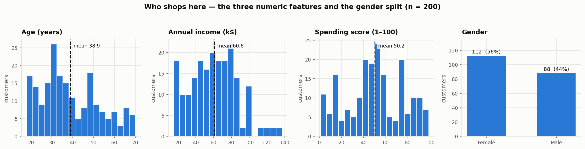
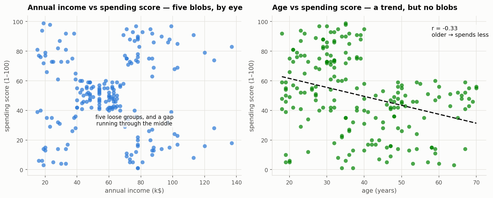
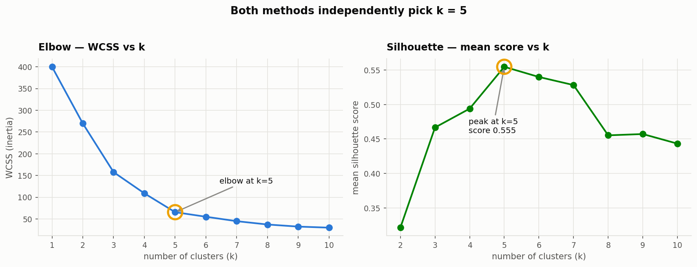
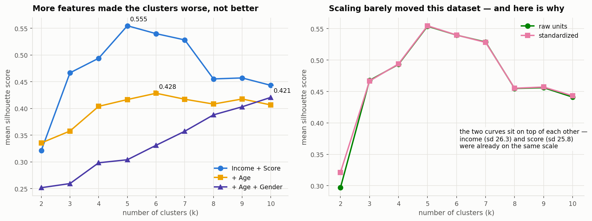
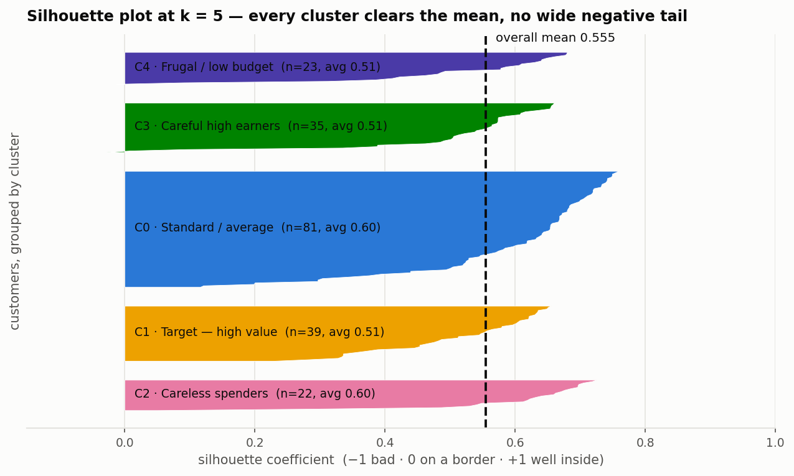
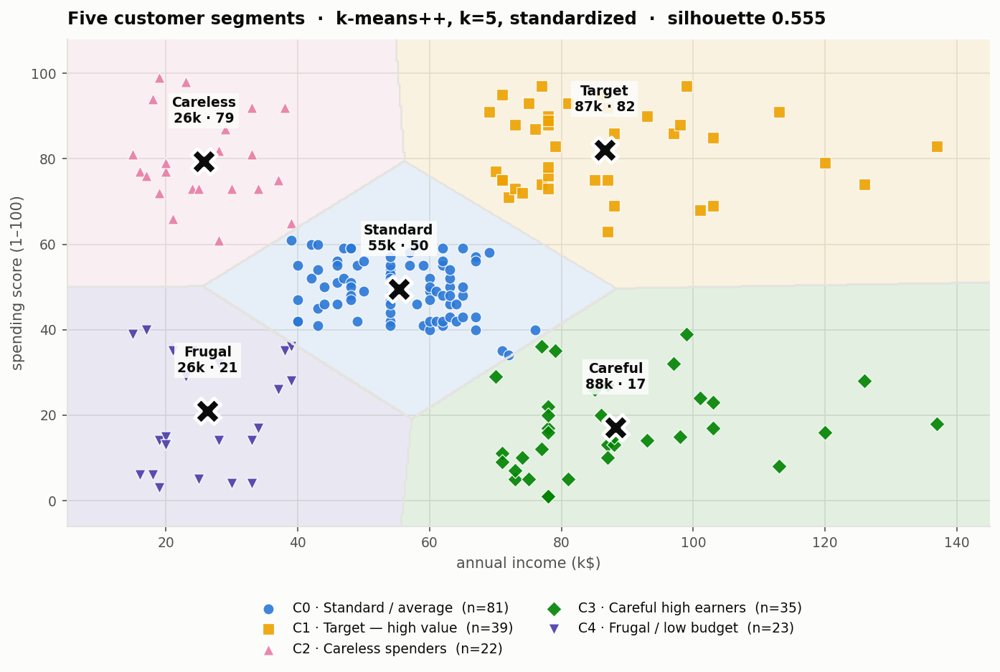
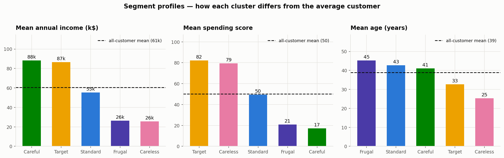

# Project — Mall Customer Segmentation

> **The brief.** You own the mall and want to understand your customers — in
> particular, who can be converted most easily (the target customers) — so the
> marketing team can plan strategy accordingly.
> — [ProjectProblemStatement.docx](<ProjectProblemStatement.docx>)

This is the applied companion to [README.md](<README.md>), which explains how
K-Means works. Here we use it. Every step states **why** before **how**, and
[§7](#7-improving-the-model) is an honest, measured account of what actually made
the clusters better.

**Data:** [Project_mall_customers.csv](<Project_mall_customers.csv>) — 200 customers.

| Column | Meaning |
| ------ | ------- |
| `CustomerID` | Unique ID |
| `Gender` | Male / Female |
| `Age` | Age in years |
| `Annual Income (k$)` | Annual income, thousands of dollars |
| `Spending Score (1-100)` | Mall's own score of how much and how readily the customer spends |

The spending score is the interesting column: it is the mall's existing measure of
**behaviour**, not demographics. Income tells you what someone *could* spend;
spending score tells you what they *do* spend. The gap between those two is where
the marketing insight lives.

---

## 1. Setup

```python
import numpy as np
import pandas as pd
import matplotlib.pyplot as plt
import seaborn as sns

from sklearn.preprocessing import StandardScaler
from sklearn.cluster import KMeans
from sklearn.metrics import (
    silhouette_score,
    silhouette_samples,
    calinski_harabasz_score,
    davies_bouldin_score,
)

sns.set_style("whitegrid")
RANDOM_STATE = 42          # every result below reproduces exactly with this seed
```

---

## 2. Load and inspect

**Intuition — why look before modelling.** K-Means is a distance algorithm with no
defence against nulls, duplicates, or a column on the wrong scale. Five minutes of
inspection now prevents a clustering that is really just measuring an artefact.

```python
df = pd.read_csv("Project_mall_customers.csv")
df.columns = ["CustomerID", "Gender", "Age", "Income", "Score"]   # shorter to type

df.shape            # (200, 5)
df.isnull().sum()   # all zero
df.duplicated().sum()   # 0
df.describe()
```

|  | Age | Income (k$) | Score |
| --- | ---: | ---: | ---: |
| count | 200 | 200 | 200 |
| mean | 38.85 | 60.56 | 50.20 |
| std | 13.97 | 26.26 | 25.82 |
| min | 18 | 15 | 1 |
| 25% | 28.75 | 41.50 | 34.75 |
| 50% | 36 | 61.50 | 50 |
| 75% | 49 | 78 | 73 |
| max | 70 | 137 | 99 |

Gender: **112 Female (56%), 88 Male (44%)**.

Three things worth noting immediately:

1. **No missing values, no duplicates.** Nothing to clean — unusual, and a relief.
2. **Income and Score have almost identical spread** (std 26.3 and 25.8). Flag
   this: it will determine how much feature scaling actually matters
   ([§5](#5-feature-scaling)).
3. **`CustomerID` is an identifier, not a feature.** It must never enter the
   model. Its range (1–200) would dominate every distance calculation with pure
   noise. [§7](#7-improving-the-model) shows exactly what happens when it does.

---

## 3. Exploratory analysis

### 3.1 What does each feature look like on its own?



- **Age** is right-skewed — a young customer base, bunched around 30, tailing off
  past 50.
- **Income** is roughly bell-shaped around 60k with a thin tail to 137k.
- **Spending score** is the revealing one. It is **not** a single hump — there is a
  dense mass in the middle around 50 and lighter clumps at the extremes. That
  shape is a hint that distinct behavioural groups exist.
- **Gender** is close to balanced, so no class is being drowned out.

### 3.2 How do the features relate to each other?

**Intuition — this is the step that chooses your features.** Clustering looks for
*groups*, and groups show up in a scatter plot as visually separated blobs. So
plot the candidate pairs and ask a single question of each: *do I see blobs, or do
I see one cloud?*



This is the whole analysis in one picture.

- **Income vs Spending score** separates into roughly **five** visible groups with
  clear gaps between them. That is exactly what K-Means is built to find.
- **Age vs Spending score** shows a *trend* (`r = −0.33`: older customers spend
  somewhat less) but **no blobs**. It is one diffuse cloud.

The correlation matrix confirms there is no redundancy to worry about:

| | Age | Income | Score |
| --- | ---: | ---: | ---: |
| **Age** | 1.00 | −0.01 | **−0.33** |
| **Income** | −0.01 | 1.00 | 0.01 |
| **Score** | −0.33 | 0.01 | 1.00 |

Income and spending score are essentially **uncorrelated** (0.01). That is good
news: they carry independent information, so together they describe a genuine
two-dimensional space of customer behaviour rather than one axis in disguise.

---

## 4. Choosing the features

**Intuition.** A common instinct is to feed the model everything available. That
instinct is wrong for clustering, and it is worth being precise about why.

Distance sums a contribution from every feature. A feature with no group structure
does not sit there neutrally — it adds *noise* to every pairwise distance, which
blurs the boundaries between the groups that do exist. In clustering there is no
regularization and no target to tell the model which features to ignore. **Every
feature you include, the model must use.**

So each column has to earn its place:

| Feature | Include? | Reasoning |
| ------- | -------- | --------- |
| `CustomerID` | **No** | An identifier. Pure noise with a large range. |
| `Gender` | **No** | Binary. After scaling it becomes two spikes at ±1, splitting every genuine cluster in half along an axis carrying no behavioural signal. |
| `Age` | **No** | Real signal (`r = −0.33` with score), but a *trend*, not groups. Tested and measured in [§7](#7-improving-the-model). |
| `Income` | **Yes** | Half of the visible blob structure. |
| `Score` | **Yes** | The other half, and the behaviour we actually care about. |

We will **verify this choice empirically** rather than just asserting it —
[§7](#7-improving-the-model) fits the alternatives and compares them.

```python
X = df[["Income", "Score"]].values
```

---

## 5. Feature scaling

**Intuition.** K-Means measures distance, and distance is dominated by whichever
feature has the largest numeric spread. Scaling puts every feature in the same
unit — standard deviations from its own mean — so each contributes equally.

```python
scaler = StandardScaler()
X_scaled = scaler.fit_transform(X)
```

**And now the honest part.** On *this* dataset scaling barely matters, because
income (std 26.3) and spending score (std 25.8) were already on comparable
scales. Measured at `k = 5`:

| | Silhouette |
| --- | ---: |
| Raw units | 0.5539 |
| Standardized | **0.5547** |

A difference in the fourth decimal place. We scale anyway, for three reasons:
it is one line; it becomes essential the moment anyone adds a feature on a
different scale; and it makes `.inertia_` comparable between models. But knowing
*why* it did not matter here is more valuable than performing the ritual — if
scaling ever changes your clusters dramatically, that is real information about
your features.

---

## 6. Choosing k

`k` is the one parameter K-Means cannot learn. We use two independent methods and
require them to agree.

### 6.1 The elbow method

```python
wcss = []
for k in range(1, 11):
    km = KMeans(n_clusters=k, init="k-means++", n_init=10, random_state=RANDOM_STATE)
    km.fit(X_scaled)
    wcss.append(km.inertia_)
```

### 6.2 The silhouette score

```python
sil = []
for k in range(2, 11):                     # from 2 — silhouette needs ≥2 clusters
    km = KMeans(n_clusters=k, init="k-means++", n_init=10, random_state=RANDOM_STATE)
    labels = km.fit_predict(X_scaled)
    sil.append(silhouette_score(X_scaled, labels))
```



Both land on the same answer. The numbers:

| k | WCSS | Drop from previous | Silhouette |
| --: | ---: | ---: | ---: |
| 1 | 400.00 | — | — |
| 2 | 269.69 | 32.6% | 0.3213 |
| 3 | 157.70 | 41.5% | 0.4666 |
| 4 | 108.92 | 30.9% | 0.4939 |
| **5** | **65.57** | **39.8%** | **0.5547** ← peak |
| 6 | 55.06 | 16.0% | 0.5399 |
| 7 | 44.86 | 18.5% | 0.5281 |
| 8 | 37.23 | 17.0% | 0.4552 |
| 9 | 32.39 | 13.0% | 0.4571 |
| 10 | 29.98 | 7.4% | 0.4432 |

**Reading it.** The WCSS drop stays around 30–40% all the way to `k = 5`, then
**collapses to 16%**. Up to five clusters, each new cluster is separating a
genuinely distinct group; after five, it is just slicing coherent groups in half.
The silhouette score peaks at exactly the same place and then declines steadily.

Two independent criteria agreeing on `k = 5` — and a scatter plot in which five
groups are visible to the naked eye — is about as clear as this decision gets.

**Automating the elbow.** The notebook uses `kneed`:

```python
# pip install kneed
from kneed import KneeLocator
kl = KneeLocator(range(1, 11), wcss, curve="convex", direction="decreasing")
print(kl.elbow)     # -> 5
```

Without the dependency, the same geometric idea — the point furthest from the
chord joining the curve's endpoints — is four lines and returns 5 as well:

```python
k_range = np.arange(1, 11)
kn = (k_range - k_range.min()) / (k_range.max() - k_range.min())
yn = (np.array(wcss) - min(wcss)) / (max(wcss) - min(wcss))
d = np.array([kn[-1] - kn[0], yn[-1] - yn[0]]); d = d / np.linalg.norm(d)
p = np.stack([kn - kn[0], yn - yn[0]], axis=1)
print(k_range[np.argmax(np.linalg.norm(p - (p @ d)[:, None] * d, axis=1))])   # -> 5
```

---

## 7. Improving the model

The brief asks to improve the model's accuracy. **Clustering has no accuracy** —
there are no true labels to be right or wrong about. What we can improve is
**cluster quality**: how tight each cluster is and how well separated they are.
Three standard measures, used together:

| Metric | Range | Good is | Measures |
| ------ | ----- | ------- | -------- |
| **Silhouette** | −1 to +1 | higher | Cohesion vs separation, per point |
| **Calinski–Harabasz** | 0 to ∞ | higher | Between-cluster variance ÷ within-cluster variance |
| **Davies–Bouldin** | 0 to ∞ | **lower** | Average similarity of each cluster to its most similar neighbour |

Here is the actual path from a naive first attempt to the final model. It is not a
straight line, and the place where it goes backwards is the most instructive part.

| # | Configuration | Silhouette |
| - | ------------- | ---------: |
| 1 | Everything incl. `CustomerID`, raw units, `k=3`, `init="random"`, `n_init=1` | 0.3709 |
| 2 | Drop `CustomerID` | 0.3106 |
| 3 | Standardize | 0.2595 |
| 4 | Drop `Gender` | 0.3578 |
| 5 | Tune `k` (→ 6) with `k-means++`, `n_init=10` | 0.4284 |
| 6 | **Drop `Age` → `Income` + `Score`, `k = 5`** | **0.5547** |

### Why the score gets worse at steps 2 and 3

This is the trap. Configuration 1 scores **higher** than the two that follow — and
it is the worst model of the six.

`CustomerID` runs from 1 to 200, a far larger range than any other column, so in
raw units it dominates the distance calculation. K-Means duly returned three tidy,
well-separated clusters that are essentially **bands of consecutive IDs** —
roughly 1–70, 71–141 and 136–200, overlapping only slightly where the real
features tipped the balance. Geometrically excellent. Analytically worthless: the
"segments" are close to just the order the rows happen to sit in the file.

Removing it (step 2) and then scaling (step 3) *removed the artefact*, and the
score fell because the remaining features genuinely contain less separable
structure than a synthetic ID gradient. The metric was never wrong; it was
answering "are these clusters geometrically tidy?", which is not the same question
as "are these clusters useful?"

> **The lesson:** an internal metric can only judge shape. It cannot tell you
> whether the features are meaningful. Sanity-check what a cluster *is* before
> trusting what a metric says about it.

### Why dropping features helped

Steps 4 and 6 both **removed** a feature and both **improved** the clustering:



| Feature set | Best k | Best silhouette |
| ----------- | -----: | --------------: |
| **Income + Score** | **5** | **0.5547** |
| + Age | 6 | 0.4284 |
| + Age + Gender | 10 | 0.4208 |

Adding `Age` costs 0.13 of silhouette. Adding `Gender` on top costs a little more
and pushes the apparent best `k` out to 10 — the classic signature of a noise
feature, where the model needs ever more clusters to carve up a space that has no
real structure in that direction.

This is worth internalizing because it inverts a supervised-learning instinct.
More features usually help a classifier, which can learn to down-weight the
useless ones. Clustering has no such mechanism: **every feature you supply gets an
equal vote in every distance.** `Age` has real signal about spending, but it is a
gradient, not a grouping — and a gradient in the distance metric smears the
boundaries between groups that are genuinely there.

### Fixing initialization

Separately from feature choice, the model has to actually find the best solution
for the features it is given. From [README §7](<README.md#7-the-random-initialization-trap-and-k-means>),
measured here on this dataset over 20 random seeds at `k = 5`:

| Setup | Distinct solutions | Worst WCSS |
| ----- | -----------------: | ---------: |
| `init="random"`, `n_init=1` | 10 | 136.3 |
| `init="k-means++"`, `n_init=1` | 5 | 98.8 |
| **`init="k-means++"`, `n_init=10`** | **1** | **65.6** |

With `n_init=1`, half of all seeds returned a *different* clustering, the worst of
them **twice** as bad as the best. With `k-means++` and 10 restarts, all 20 seeds
returned the identical result. That costs about ten milliseconds.

### The final model

```python
kmeans = KMeans(
    n_clusters=5,
    init="k-means++",
    n_init=10,
    random_state=RANDOM_STATE,
)
df["Cluster"] = kmeans.fit_predict(X_scaled)

centers = scaler.inverse_transform(kmeans.cluster_centers_)   # back to real units
```

| Metric | Value |
| ------ | ----: |
| Silhouette | **0.5547** |
| Calinski–Harabasz | **248.6** |
| Davies–Bouldin | **0.5722** |
| WCSS (`inertia_`) | 65.57 |

All three agree that `k = 5` is the best of the candidates tested — they are
computed differently, so agreement is meaningful.

---

## 8. Validating the result

A single averaged number can hide a bad cluster. Two more checks before trusting
this.

### 8.1 The silhouette plot

**Intuition.** The mean silhouette of 0.555 could come from four excellent
clusters and one terrible one. Plotting every customer's individual score, grouped
by cluster, shows the distribution instead of the average.

```python
from sklearn.metrics import silhouette_samples
values = silhouette_samples(X_scaled, df["Cluster"])
```



What to look for, and what we see:

| Check | Result |
| ----- | ------ |
| Does every cluster reach the overall mean? | **Yes** — all five blades cross the dashed line |
| Are any clusters mostly below the mean? | **No** |
| Are there wide negative tails (misassigned points)? | **No** — only **2 of 200** customers score below zero |
| Are cluster sizes wildly unbalanced? | Reasonable — 22 to 81 |

Per-cluster averages: 0.598, 0.511, 0.598, 0.505, 0.511. Evenly good. The two
negative points sit on the boundary between the "Standard" cluster and a
neighbour, which is expected where a dense middle group meets its neighbours.

### 8.2 Stability

**Intuition.** If a clustering is real, it should not depend on the random seed.

```python
from sklearn.metrics import adjusted_rand_score

base = KMeans(n_clusters=5, init="k-means++", n_init=10, random_state=42).fit_predict(X_scaled)
for seed in range(20):
    labels = KMeans(n_clusters=5, init="k-means++", n_init=10, random_state=seed).fit_predict(X_scaled)
    assert adjusted_rand_score(base, labels) == 1.0
```

All 20 seeds produce the **identical** partition (ARI = 1.000). We use
`adjusted_rand_score` rather than comparing labels directly because cluster **IDs
are arbitrary** — the same grouping can be numbered differently on different runs.
ARI compares which points share a cluster, ignoring the numbering.

---

## 9. The five segments



The five regions are exactly the structure that was visible by eye in
[§3.2](#32-how-do-the-features-relate-to-each-other) — now with boundaries and
centroids. The shaded regions show where a *new* customer would be assigned.



| Cluster | Name | n | Income | Score | Age | Female |
| ------- | ---- | -: | -----: | ----: | --: | -----: |
| **C1** | Target — high value | 39 | 86.5k | 82.1 | 32.7 | 53.8% |
| **C3** | Careful high earners | 35 | 88.2k | 17.1 | 41.1 | 45.7% |
| **C0** | Standard / average | 81 | 55.3k | 49.5 | 42.7 | 59.3% |
| **C2** | Careless spenders | 22 | 25.7k | 79.4 | 25.3 | 59.1% |
| **C4** | Frugal / low budget | 23 | 26.3k | 20.9 | 45.2 | 60.9% |

### What each cluster conveys

**C1 · Target — high value** (39 customers, 20%)
High income *and* high spending — around 87k with a spending score of 82. They can
afford to spend and they do. **This is the answer to the brief's question.** Also
the youngest of the high-income groups (mean age 33), which implies a long
customer lifetime. They contribute an estimated **32% of total spending** from 20%
of the customer base.

**C3 · Careful high earners** (35 customers, 18%)
The strategic puzzle. Highest income of any segment (88.2k) but the **lowest
spending score of all (17.1)**. They have the money and are not spending it here —
so it is going somewhere else. This is the **largest untapped opportunity** in the
dataset: 18% of customers contributing about 6% of spending. Converting even part
of this group is worth more than optimizing anyone else.

**C0 · Standard / average** (81 customers, 41%)
The core of the mall — mid income, mid spending, and the largest group by a wide
margin. Unremarkable individually, but 41% of customers and roughly **40% of
total spending**. The risk here is neglect: it is easy to design campaigns for the
interesting extremes and forget where the revenue actually comes from.

**C2 · Careless spenders** (22 customers, 11%)
Low income (25.7k) but high spending score (79.4), and by far the **youngest group
(mean age 25)**. Students and early-career shoppers spending a large share of a
small income. Valuable now and potentially a future C1 — but exposed if their
circumstances tighten.

**C4 · Frugal / low budget** (23 customers, 12%)
Low income and low spending, oldest group (45). Behaving sensibly given their
means. Realistically the lowest-priority segment: little headroom to spend more.

### Where the money is

Using `spending score × customers` as a proxy for revenue share:

| Segment | Customers | Est. share of spending |
| ------- | --------: | ---------------------: |
| C0 · Standard | 41% | **40%** |
| C1 · Target | 20% | **32%** |
| C2 · Careless | 11% | 17% |
| C3 · Careful high earners | 18% | **6%** ← the gap |
| C4 · Frugal | 12% | 5% |

C1 and C0 together are roughly **72% of spending**. C3 is 18% of customers
producing 6% of spending — the clearest imbalance in the table.

---

## 10. Recommendations

| Segment | Strategy | Rationale |
| ------- | -------- | --------- |
| **C1 · Target** | Loyalty tiers, early access, premium brand partnerships. Protect this group first. | Highest value per customer, young enough for a long relationship. Losing one costs more than gaining a C4. |
| **C3 · Careful high earners** | Research *why* first — survey, then test. They are not price-sensitive, so discounting is the wrong lever; the issue is likely brand mix, convenience, or experience. | Largest addressable upside. 18% of customers, 6% of spending. |
| **C0 · Standard** | Broad campaigns, seasonal promotions, bundles that nudge basket size up slightly. | Small per-customer gains multiply across 41% of the base. |
| **C2 · Careless** | Student offers, instalment options, social-first campaigns. Low spend per head — keep acquisition cost low. | Young and highly engaged; tomorrow's C1 if incomes rise. |
| **C4 · Frugal** | Value ranges and essentials. Do not spend acquisition budget here. | Limited headroom; effort is better spent on C3. |

**The headline for the marketing team:** the easiest customers to convert are
**C1**, and they are already converted — so the priority is retention. The largest
*new* revenue is locked in **C3**, who have the highest incomes in the mall and
spend the least of anyone. That is where to look next.

---

## 11. Caveats

Worth stating plainly alongside the recommendations:

- **200 customers is a small sample.** The segments are clear, but the exact
  boundaries would shift with more data.
- **"Spending score" is not defined** in the brief. It is the mall's own
  behavioural measure, and every conclusion inherits whatever it actually
  captures.
- **These clusters describe, they do not explain.** C3's low spending is a fact;
  *why* they don't spend is not in this dataset. That needs a survey.
- **Two features, deliberately.** `Age` and `Gender` were tested and excluded on
  measured grounds ([§7](#7-improving-the-model)). They may still matter for
  *how* you talk to a segment, even though they do not help define it — note that
  C2 averages 25 and C4 averages 45.
- **`k = 5` is well-supported but not sacred.** `k = 6` scores 0.5399, close
  behind. Five is preferred because it is simpler and both criteria agree on it.
- **Re-fit periodically.** Customer behaviour drifts; the segments will too.

---

## 12. The complete script

```python
"""Mall customer segmentation with K-Means. Reproduces every number above."""
import numpy as np
import pandas as pd
import matplotlib.pyplot as plt
import seaborn as sns
from sklearn.preprocessing import StandardScaler
from sklearn.cluster import KMeans
from sklearn.metrics import (silhouette_score, silhouette_samples,
                             calinski_harabasz_score, davies_bouldin_score,
                             adjusted_rand_score)

RANDOM_STATE = 42

# 1 ── load ────────────────────────────────────────────────────────────────
df = pd.read_csv("Project_mall_customers.csv")
df.columns = ["CustomerID", "Gender", "Age", "Income", "Score"]
assert df.isnull().sum().sum() == 0 and df.duplicated().sum() == 0

# 2 ── features: income + spending score only (see §4 and §7) ──────────────
X = df[["Income", "Score"]].values
scaler = StandardScaler()
X_scaled = scaler.fit_transform(X)

# 3 ── choose k ────────────────────────────────────────────────────────────
wcss, sil = [], []
for k in range(1, 11):
    km = KMeans(n_clusters=k, init="k-means++", n_init=10, random_state=RANDOM_STATE)
    labels = km.fit_predict(X_scaled)
    wcss.append(km.inertia_)
    if k > 1:
        sil.append(silhouette_score(X_scaled, labels))

best_k = range(2, 11)[int(np.argmax(sil))]
print(f"best k by silhouette: {best_k}")            # -> 5

# 4 ── final model ─────────────────────────────────────────────────────────
kmeans = KMeans(n_clusters=best_k, init="k-means++", n_init=10,
                random_state=RANDOM_STATE)
df["Cluster"] = kmeans.fit_predict(X_scaled)
centers = scaler.inverse_transform(kmeans.cluster_centers_)

print(f"silhouette         {silhouette_score(X_scaled, df.Cluster):.4f}")   # 0.5547
print(f"calinski-harabasz  {calinski_harabasz_score(X_scaled, df.Cluster):.1f}")  # 248.6
print(f"davies-bouldin     {davies_bouldin_score(X_scaled, df.Cluster):.4f}")     # 0.5722

# 5 ── validate: stability across seeds ────────────────────────────────────
base = df["Cluster"].values
assert all(
    adjusted_rand_score(
        base,
        KMeans(n_clusters=best_k, init="k-means++", n_init=10,
               random_state=s).fit_predict(X_scaled),
    ) == 1.0
    for s in range(20)
)

# 6 ── profile the segments ────────────────────────────────────────────────
NAMES = {0: "Standard / average", 1: "Target — high value", 2: "Careless spenders",
         3: "Careful high earners", 4: "Frugal / low budget"}
profile = (df.groupby("Cluster")
             .agg(n=("CustomerID", "size"), Age=("Age", "mean"),
                  Income=("Income", "mean"), Score=("Score", "mean"))
             .round(1))
profile["Segment"] = profile.index.map(NAMES)
print(profile.to_string())

# 7 ── plot ────────────────────────────────────────────────────────────────
fig, ax = plt.subplots(figsize=(9, 6))
for k in range(best_k):
    m = df.Cluster == k
    ax.scatter(df.Income[m], df.Score[m], s=50, label=f"{k} · {NAMES[k]}")
ax.scatter(centers[:, 0], centers[:, 1], s=300, marker="X", c="black", zorder=5)
ax.set_xlabel("Annual income (k$)")
ax.set_ylabel("Spending score (1–100)")
ax.set_title(f"Mall customer segments (k={best_k})")
ax.legend()
plt.show()
```

---

## Summary

- Five segments, found with K-Means on **income and spending score**, standardized,
  `k` chosen by agreement between the elbow method and the silhouette score.
- Final quality: **silhouette 0.555**, Calinski–Harabasz 248.6, Davies–Bouldin
  0.572; every cluster clears the mean silhouette, only 2 of 200 points are
  ambiguous, and the partition is identical across 20 random seeds.
- The clusters improved most by **removing** features, not adding them — a
  clustering-specific instinct worth keeping, since every feature gets an equal
  vote in every distance.
- An internal metric measures **shape, not usefulness**: the naive model scored
  0.371 by clustering on `CustomerID` ranges. Always look at what a cluster *is*.
- **The business answer:** target customers are **C1** (high income, high spend —
  retain them), and the biggest untapped opportunity is **C3**, the 18% of
  customers with the highest incomes in the mall and the lowest spending of anyone.

---

**Back to:** [README.md](<README.md>) — how the algorithm works.
